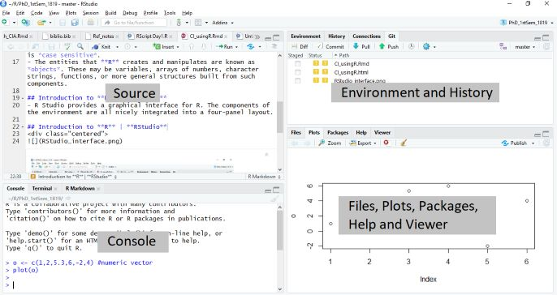

```{r include=FALSE}
knitr::opts_chunk$set(comment = '')
knitr::opts_chunk$set(prompt = T)
```
**Outline**

- Introduction to **R**
  1. The **R** Environment
  2. RStudio
  3. Basic Commands
  
# Introduction to **R**

## The **R** Environment  
- **R** is an integrated suite of software facilities for data manipulation, calculation and graphical display.
- It is an open-source software environment for statistical computing and graphics.
- It is an environment within which many classical and modern statistical techniques have been implemented.
- A few of these techniques are built into the base **R** environment, but many are supplied as packages.
- **R** is an *expression language* with a very simple syntax. It is *case sensitive*.
- The entities that **R** creates and manipulates are known as *objects*. These may be variables, arrays of numbers, character strings, functions, or more general structures built from such components.

## RStudio
- R Studio provides a graphical interface for **R**. The components of the environment are all nicely integrated into a four-panel layout.  

- The RStudio provides most of the desired features of **R** in an Integrated Development Environment (IDE).
- The **console** provides the command-line interface for interactive use of **R**. This is where users issue commands for **R** to evaluate.
- The **source** tab is a built-in text editor.
- The **Environment** tab is an interactive list of **R** objects.
- The **Files** tab displays the files and subdirectories of a given directory.
- Display of graphics is rendered in the **Plots** tab.
- RStudio keeps a stack of past commands and allows one to scroll through them easily. This can be done using the up or down keys. In addition, the **History** tab allows one to scroll through past commands.
- The **Packages** tab allows users to effortlessly load, install, update, and/or delete packages in the library of packages.
- The **Help** tab is an output location for help commands and help search window.
- The **Viewer** tab is an advanced tab for local web content.

## Data Type and Objects
- Scalars -- atomic quantity and can hold only one value at a time.  
Examples: number, logical value, character(string)
- Vector -- a sequence of data elements of the same basic type.
- Matrix -- a collection of data elements in a rectangular layout.
- Data Frame -- more general than a matrix, in that different columns can have different basic types.
- List -- a generic vector containing other objects.

## Basic Commands
- Before everything else, set your working directory. Setting the working directory is choosing a folder to save your work. You can set the working directory using the File tab or the function `setwd()`.
- Typing `?funcname` will cause **R** to open a new help file window with additional information about the function `funcname`
- We can assign values in **R** using `<-` operator.  
*Example*
```{r}
x <- 143
x
```
```{r}
y <- 198
y
```
```{r}
x + y
```
```{r}
z <- x + y
z
```
- **R** uses *functions* to perform operations. To run a function called `funcname`, we type  
`funcname(input1, input2)`  
*Example*  
We use the function `c()` to create a vector of numbers
```{r}
x <- c(1, 4, 3, 4, 4)
x
```
- Note that the prompt, `>`, is not part of the command; rather, it is printed by **R** to indicate that it is ready for another command to be entered.
- Hitting the *up arrow key* multiple times will display the previous commands, which can then be edited.
- a `+` sign replacing `>` indicates that your code is not complete and that **R** is asking you to complete your code.

## Creating Functions in R
- We can write functions in R!

*Example*  
Suppose we want to write a function for average. The formula for average is  
$$average=\frac{\sum{x}}{n}$$  
where $x$ is a vector and $n$ is a scalar containing the number of elements in $x$.  
```{r}
average <- function(x){
  sum(x)/length(x)
}
```
```{r}
y <- c(4, 3, 5, 1, 7)
```
```{r}
average(y)
```  
or  
```{r}
average <- function(x){
  a <- sum(x)
  b <- length(x)
  c <- a/b
  return(c)
}
```
```{r}
average(y)
```  
or  
```{r}
mean(y)
```

# Confidence Intervals for the Mean (Large Samples)

## Finding a Confidence Interval for a Population Mean

1. Find the sample statistics $n$ and $\bar{x}$.  
$$\bar{x}=\frac{\sum{x}}{n}$$  
In **R** we have the function `mean()`.

2. Specify $\sigma$, if known. Otherwise, if $n\ge 30$, find the sample standard deviation $s$ and use it as an estimate for $\sigma$.  
$$s=\sqrt{\frac{\sum{(x-\bar{x})^2}}{n-1}}$$  
In **R** we have the function `sd()`.

3. Find the critical value $z_{c}$ that corresponds to the given level of confidence.

*Example*  
For $c=95\%\;\text{ or }\; 0.95$
```{r}
qnorm((1+0.95)/2)
```

4. Find the margin of error $E$.  
$$E=z_{c}\frac{\sigma}{\sqrt{n}}$$

5. Find the left and right endpoints and form the confidence interval.

LEP  
$$\bar{x}-E$$  
REP  
$$\bar{x}+E$$  
Interval  
$$\bar{x}-E<\mu<\bar{x}+E$$
or  
$$(\bar{x}-E,\;\bar{x}+E)$$
